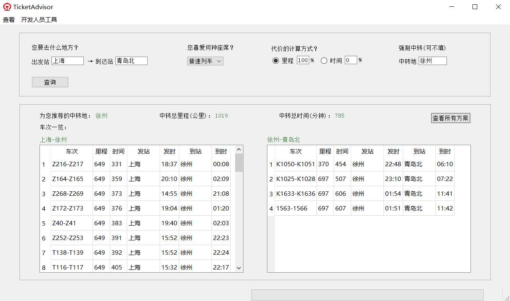

#### 复旦大学2019-2020学年秋季学期

#### Fall 2019, Fudan University

## Artificial Intelligence A 人工智能A (COMP130031.01) Course Project

This is the course project of our "Artificial Intelligence" course, in which we're asked to build an expert system according to Chapter 2-5 of the book *Artificial Intelligence: Guide to Intelligent Systems (3rd Ed)*.

I present **TicketAdvisor**, an expert system which asks users' requirements and recommend a railway transfer scheme for them. TicketAdvisor is an expert system based on frame, and it comes with a GUI that's easy to use. Note that some front-end functions are bypassed to save time.

This repository also includes a database of full 12306 train timetable in China (obsolete) that I searched from the Internet, for your reference. #中国铁路12306火车时刻表（已过期）

